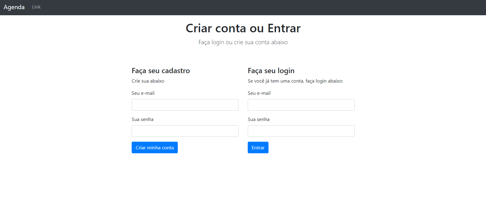

# Sua Agenda
<p align="center">
    
    
</p>

## Descrição
Sua Agenda é um pequeno projeto que permite aos usuários criar uma conta, fazer login e gerenciar uma lista simples de contatos com nomes, números de telefone e endereços de e-mail.

## Índice

1. [Instalação](#instalação)
2. [Configuração](#configuração)
3. [Uso](#uso)
4. [Funcionalidades](#funcionalidades)
5. [Tecnologias Utilizadas](#tecnologias-utilizadas)
6. [Contribuição](#contribuição)
7. [Licença](#licença)

## Instalação

Certifique-se de ter o Node.js e o MongoDB instalados em sua máquina.

1. Clone este repositório:

    ```bash
    git clone https://github.com/Truefenix/projetoagenda.git
    ```

2. Navegue até o diretório do projeto:

    ```bash
    cd sua-agenda
    ```

3. Instale as dependências:

    ```bash
    npm install
    ```

## Configuração

1. Crie um arquivo `.env` na raiz do projeto e configure as variáveis de ambiente:

    ```env
    PORT=3000
    CONNECTIONSTRING=sua_uri_do_mongodb
    SESSION_SECRET=sua_chave_secreta_para_sessao
    ```

2. Certifique-se de ter o MongoDB em execução.

## Uso

1. Inicie o servidor:

    ```bash
    npm start
    ```
1. Inicie o webpack:

    ```bash
    npm run dev
    ```

2. Abra o navegador e acesse [http://localhost:3000](http://localhost:3000).

## Funcionalidades

> - [x] Registro de conta e autenticação de usuário.
> - [x] Adição, remoção e edição de contatos.
> - [x] Armazenamento seguro dos dados no [Atlas MongoDB Cloud](https://www.mongodb.com/cloud/atlas/register).
> - [x] Armazenamento seguro usando bcrypt para senhas.
> - [x] Sessões e mensagens de flash para uma experiência do usuário aprimorada.

## Tecnologias Utilizadas

- Node.js
- Express
- MongoDB
- Mongoose
- EJS (Embedded JavaScript)
- Bcrypt.js
- Express-session
- Connect-flash
- Csurf
- Validator

---

##  🐠 Developer
<table align="center">
<tr>
<td align="center">
<a href="https://github.com/Truefenix">

<br />
<sub><b>Eduardo-Roque</b></sub>
</a>
</td>
</tr>
</table>

<h4 align="center">
By<a href="https://github.com/Truefenix" target="_blank"> Eduardo-Roque </a>🐠
</h4>